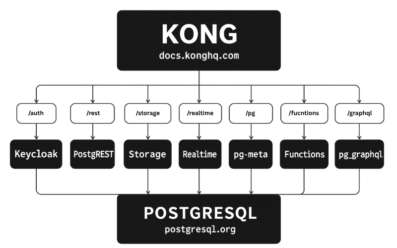
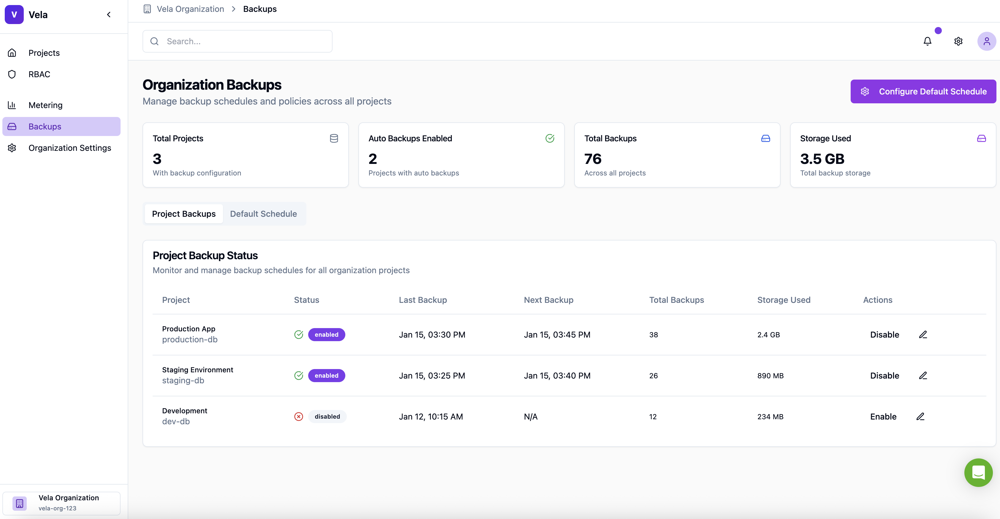
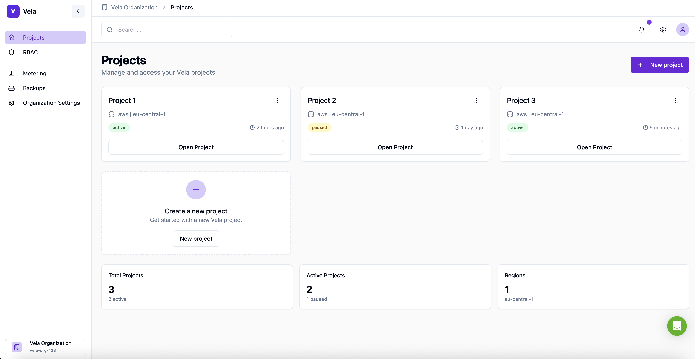
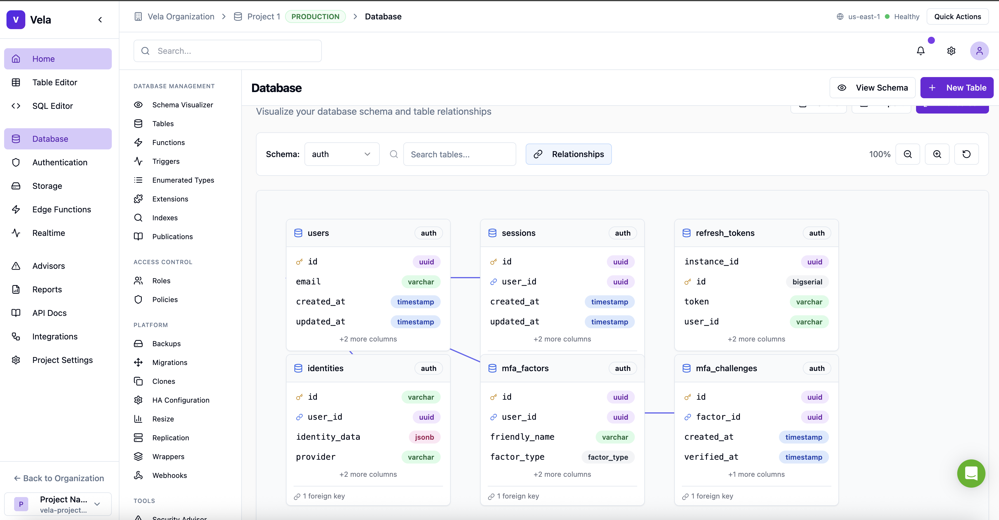
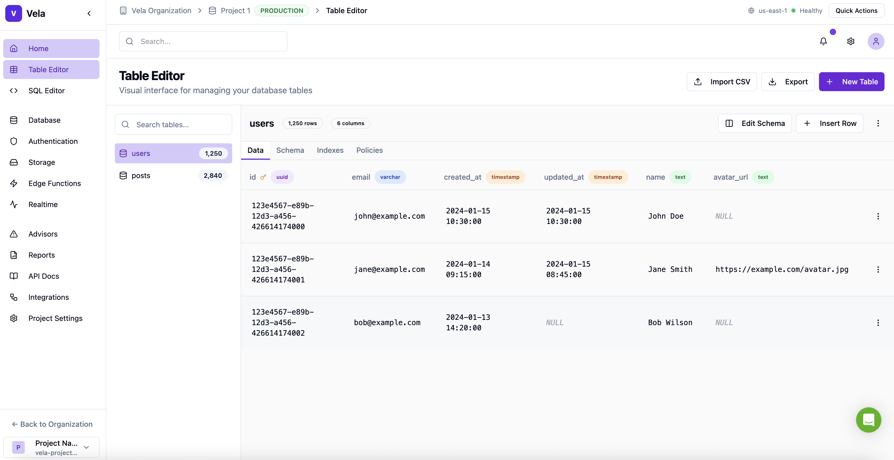

# Vela Studio

    

[Vela](https://vela.simplyblock.io) is a self-hostable, serverless Postgres development platform.  
It provides instant database branching, independent scaling of compute and storage, and enterprise-grade access control — all deployable in your own cloud.

**Vela Studio** is the web interface for managing projects, databases, and resources across your Vela environment.

---

## Features

- [x] Hosted Postgres Database. [Docs](https://vela.simplyblock.io/docs)
- [x] Authentication and Authorization
- [x] Full Role-based Access Control (RBAC)
- [x] Auto-generated APIs  
  - [x] REST  
  - [x] GraphQL  
  - [x] Realtime subscriptions
- [x] Functions  
  - [x] Database Functions  
  - [x] Edge Functions
- [x] File Storage
- [x] AI + Vector / Embeddings Toolkit
- [x] Dashboard

---

## What is Vela

Vela brings Git-like workflows to Postgres databases.  
Developers and platform teams can instantly clone, branch, and test production-grade databases without complex infrastructure setup.

Use Vela to:
- Clone production databases in seconds  
- Run isolated QA, CI/CD, or staging environments  
- Test schema changes and migrations safely  
- Scale compute, RAM, and IOPS independently  
- Integrate RBAC, IAM, and observability in one place

### Vela Explained in 50 seconds

Learn more at [vela.simplyblock.io](https://vela.simplyblock.io)

---

## Architecture

Vela is built on open-source components, combining Postgres and modern infrastructure automation to provide a complete, self-hostable platform.

- [Postgres](https://www.postgresql.org/) is a proven, object-relational database system known for reliability, feature depth, and performance.  
- [Realtime] provides WebSocket-based subscriptions to Postgres inserts, updates, and deletes.  
- [PostgREST](http://postgrest.org/) turns your PostgreSQL database directly into a RESTful API.  
- [Keycloak] centralized authentication and identity provider, shared globally across all organizations and projects
- [Storage](https://github.com/simplyblock/sbcli) distributed copy-on-write high-perfromance block storage layer.
- [pg_graphql] exposes a GraphQL API directly from your Postgres schema.  
- [postgres-meta](https://github.com/supabase/postgres-meta) provides administrative APIs to manage Postgres objects such as tables and roles.  
- [Kong](https://github.com/Kong/kong) serves as a cloud-native API gateway for routing and access control.  

---

## Screenshots

## Getting Started

### Vela Cloud (Recommended)

The easiest way to get started is through **Vela Cloud**.  
Free tier available — no credit card required.

[**Get Started**](https://vela.simplyblock.io)

## Community

Find help, explore resources, or get involved with the Vela community.

### Support & Contributions
 
- [Open an Issue](https://github.com/simplyblock/vela-studio/issues) – Report bugs or suggest improvements  
- [Start a Discussion](https://github.com/simplyblock/vela-studio/discussions) – Share feedback and feature ideas, ask questions, share ideas, and connect with other users  
- [Contribute Code](https://github.com/simplyblock/vela-studio/pulls) – Submit pull requests following our contribution guidelines  

We welcome contributions of all kinds — from documentation improvements and bug fixes to new features and integrations.

